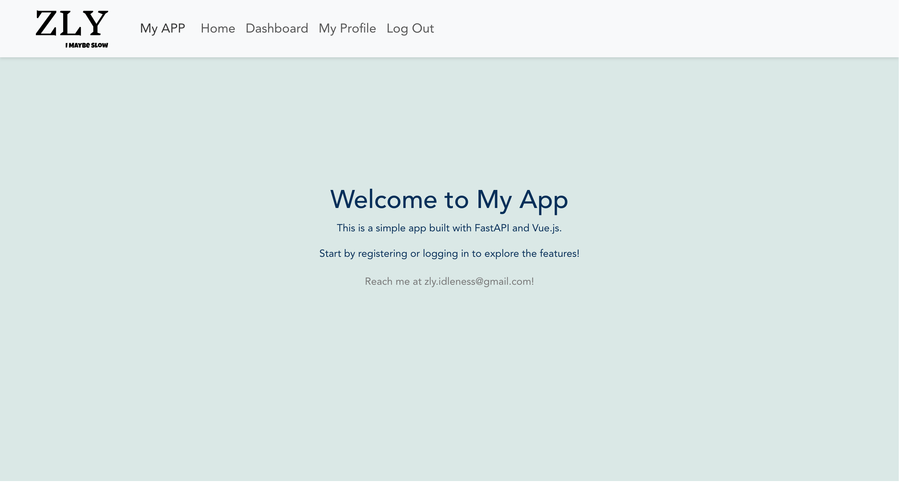
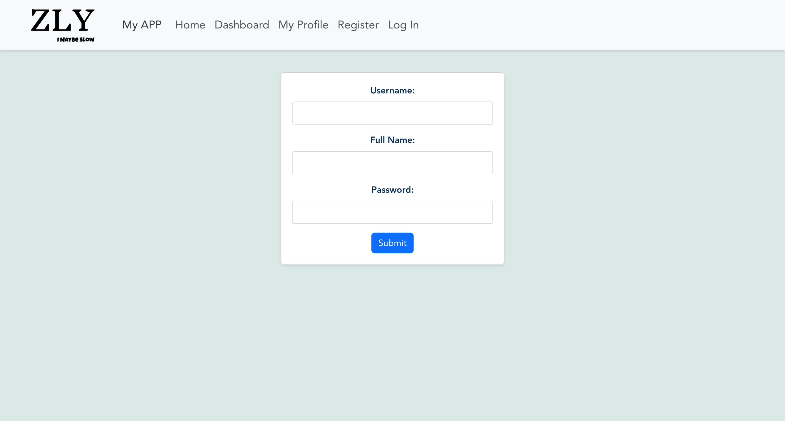
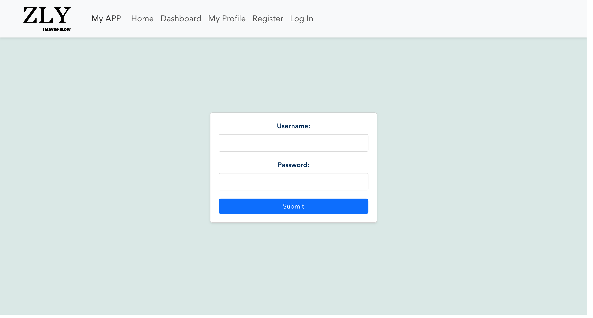
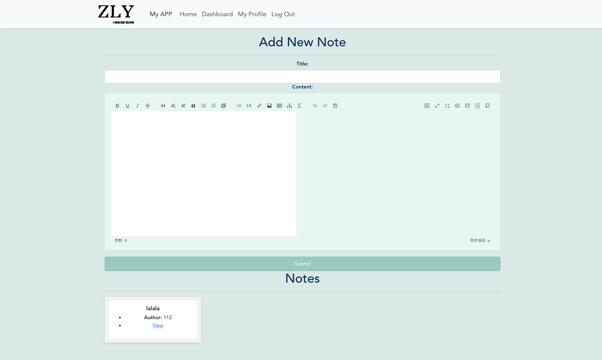
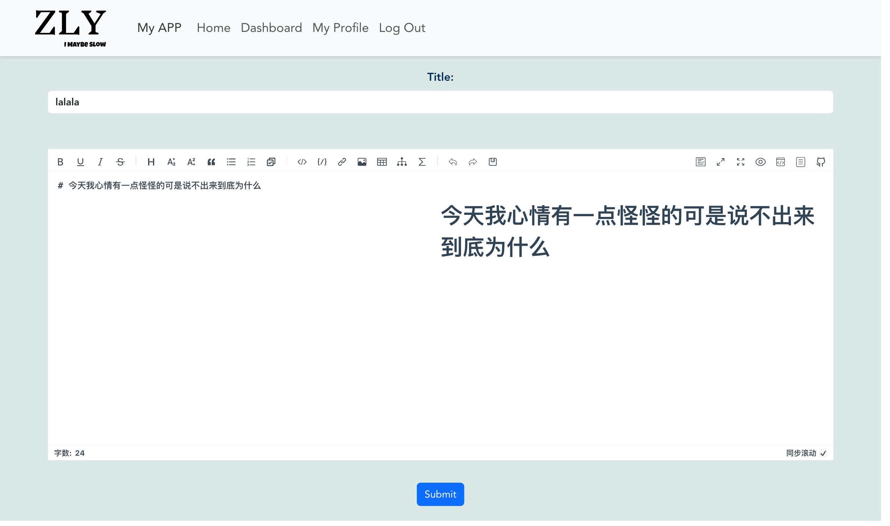
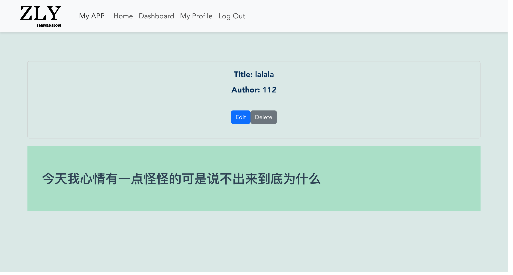
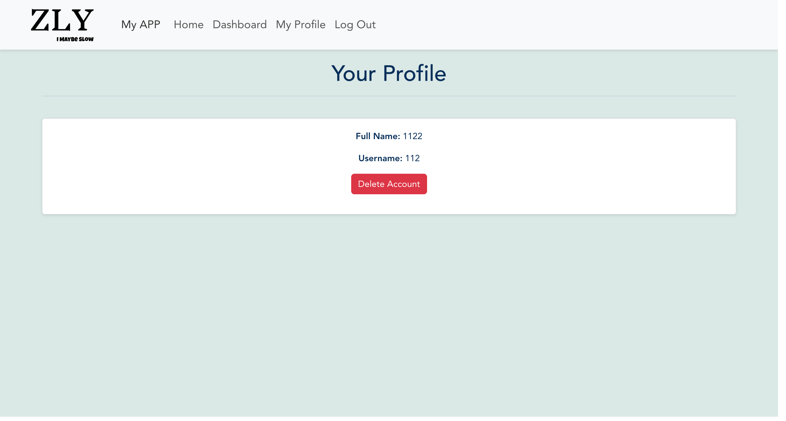

# Introduction

- This is a simple web project based on FASTAPI + VUE  

- Just made it for fun ,no need to be too serious , haha

- Well , maybe also for learning some basic web development skills

# Usage
In fastapi-vue

```shell
docker-compose up -d --build 
```
Click [localhost:8080](http://localhost:8080/) to view the page.

# Structure

## Overview
```css
.
├── docker-compose.yml
├── README.md
└── services
   ├── backend
   │  ├── Dockerfile
   │  ├── migrations
   │  ├── pyproject.toml
   │  ├── requirements.txt
   │  └── src
   └── frontend
      ├── babel.config.js
      ├── dist
      ├── Dockerfile
      ├── jsconfig.json
      ├── node_modules
      ├── package-lock.json
      ├── package.json
      ├── public
      ├── README.md
      ├── src
      └── vue.config.js

```
## Backend
```css
.
├── Dockerfile
├── migrations
│  └── models
│     └── 0_20230802123924_init.py
├── pyproject.toml
├── requirements.txt
└── src
   ├── __pycache__
   │  └── main.cpython-311.pyc
   ├── auth
   │  ├── __pycache__
   │  ├── jwthandler.py
   │  └── users.py
   ├── crud
   │  ├── __pycache__
   │  ├── notes.py
   │  └── users.py
   ├── database
   │  ├── __pycache__
   │  ├── config.py
   │  ├── models.py
   │  └── register.py
   ├── main.py
   ├── routes
   │  ├── __pycache__
   │  ├── notes.py
   │  └── users.py
   └── schemas
      ├── __pycache__
      ├── notes.py
      ├── token.py
      └── users.py
```
## Frontend
```css
.
├── App.vue
├── assets
│  ├── logo-b.png
│  └── logo.png
├── components
│  ├── HelloWorld.vue
│  └── NavBar.vue
├── main.js
├── router
│  └── index.js
├── store
│  ├── index.js
│  └── modules
│     ├── notes.js
│     └── users.js
└── views
   ├── DashboardView.vue
   ├── EditNoteView.vue
   ├── HomeView.vue
   ├── LoginView.vue
   ├── NoteView.vue
   ├── ProfileView.vue
   └── RegisterView.vue
```

# Todo

- ~~Add markdown support~~
- ~~Spiced up the appearance~~
- ~~Fix some bugs(yes, it still have some tedious bugs)~~

# Reference

[fastapi-vue by Michael Herman](https://github.com/testdrivenio/fastapi-vue)  

Thanks to these guys, my app was largely developed following their tutorial.

Also, thanks to ChatGPT, it has worked hard and provided perfect assistance, writing a lot of code for me.

# Examples Graph
## Home View



## Register



## Login



## Dashboard



## EditNote



## NoteView


## PersonalProfile



